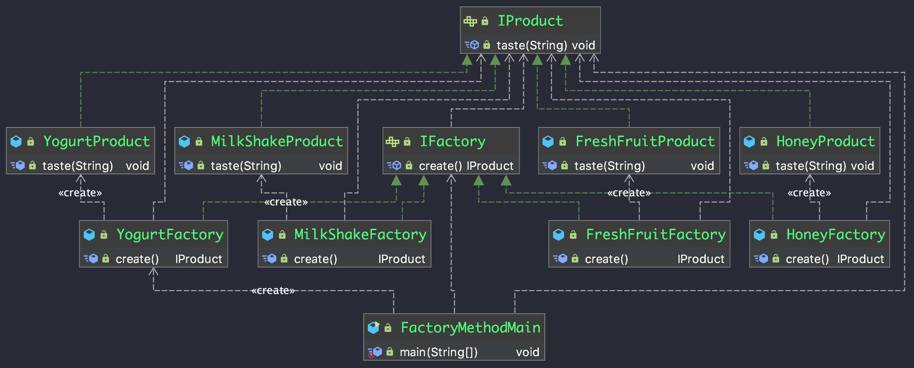

# 1.2 工厂三兄弟之二哥

工厂方法模式定义一个用于创建对象的接口,让子类决定实例化哪一个类,将一个类的实例化延迟到子类

工厂方法的出现是为了更好地解决简单工厂的缺点(耦合度高,违背开闭原则不易扩展),如果说简单工厂相当于一个总部,那工厂方法就是将总部业务拆分为一个个子公司,一个业务对应一个分公司,所有的分公司都遵循总部的一套标准规范


## 业务场景：

奶茶店生意越来越好,客户的品味越来越独特,除了鲜榨汁,还需要有酸奶系列、蜂蜜系列、奶昔系列等等


## 代码实现：

###产品
```java
package org.andywong.factorymethod.interfaces;

/**
 * 产品系列
 */
public interface IProduct {
    void taste(String name);
}
```

```java
package org.andywong.factorymethod;

import org.andywong.factorymethod.interfaces.IProduct;

/**
 * 酸奶系列
 */
public class YogurtProduct implements IProduct {
    @Override
    public void taste(String name) {
        System.out.println(name + "酸奶味");
    }
}
```

```java
package org.andywong.factorymethod;

import org.andywong.factorymethod.interfaces.IProduct;

/**
 * 奶昔系列
 */
public class MilkShakeProduct implements IProduct {
    @Override
    public void taste(String name) {
        System.out.println(name + "奶昔味");
    }
}
```

```java
package org.andywong.factorymethod;

import org.andywong.factorymethod.interfaces.IProduct;

/**
 * 蜂蜜系列
 */
public class HoneyProduct implements IProduct {
    @Override
    public void taste(String name) {
        System.out.println(name + "蜂蜜味");
    }
}
```

```java
package org.andywong.factorymethod;

import org.andywong.factorymethod.interfaces.IProduct;

/**
 * 鲜果系列
 */
public class FreshFruitProduct implements IProduct {
    @Override
    public void taste(String name) {
        System.out.println(name + "鲜果榨汁");
    }
}
```


### 工厂

```java
package org.andywong.factorymethod.interfaces;

/**
 * 工厂基类
 */
public interface IFactory {
    IProduct create();
}

```

```java
package org.andywong.factorymethod;

import org.andywong.factorymethod.interfaces.IFactory;
import org.andywong.factorymethod.interfaces.IProduct;

/**
 * 酸奶系列工厂
 */
public class YogurtFactory implements IFactory {
    @Override
    public IProduct create() {
        return new YogurtProduct();
    }
}

```

```java
package org.andywong.factorymethod;

import org.andywong.factorymethod.interfaces.IFactory;
import org.andywong.factorymethod.interfaces.IProduct;

/**
 * 奶昔系列工厂
 */
public class MilkShakeFactory implements IFactory {
    @Override
    public IProduct create() {
        return new MilkShakeProduct();
    }
}

```

```java
package org.andywong.factorymethod;

import org.andywong.factorymethod.interfaces.IFactory;
import org.andywong.factorymethod.interfaces.IProduct;

/**
 * 蜂蜜系列工厂
 */
public class HoneyFactory implements IFactory {
    @Override
    public IProduct create() {
        return new HoneyProduct();
    }
}

```

```java
package org.andywong.factorymethod;

import org.andywong.factorymethod.interfaces.IFactory;
import org.andywong.factorymethod.interfaces.IProduct;

/**
 * 鲜果系列工厂
 */
public class FreshFruitFactory implements IFactory {
    @Override
    public IProduct create() {
        return new FreshFruitProduct();
    }
}

```


### 测试类

```java
package org.andywong.factorymethod;

import org.andywong.factorymethod.interfaces.IFactory;
import org.andywong.factorymethod.interfaces.IProduct;

/**
 * 工厂方法测试
 *
 * @author andywong
 * @date 2019-05-09 21:48
 */
public class FactoryMethodMain {

    public static void main(String[] args) {
        IFactory factory = new YogurtFactory();
        IProduct product = factory.create();
        product.taste("芒果");
    }
}

```


###输出结果

```java
芒果酸奶味
```


##UML:




##优缺点:

### 优点

1.只需具体产品的工厂类,无需关心具体创建过程

2.增加产品时,只需对应增加产品类和工厂类即可,无需修改原有工厂,符合开闭原则

### 缺点

1.每增加一种产品类,需要对应增加一个工厂类,维护成本逐渐升高