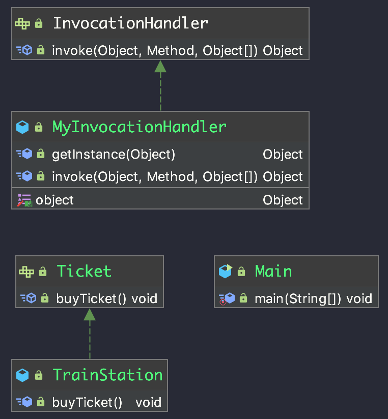

# 第二节: 动态代理

动态代理,指的是代理类不需要程序员手动写死,由jdk动态生成

 

## 代码

```java
package org.andywong.dynamicproxy;

/**
 * 代理类和被代理类的共同父类
 */
public interface Ticket {
    void buyTicket();
}

```

```java
package org.andywong.dynamicproxy;

/**
 * 火车站
 *
 * @author andywong
 * @date 2019-05-10 10:33
 */
public class TrainStation implements Ticket {
    @Override
    public void buyTicket() {
        System.out.println("火车站购票成功");
    }
}

```

```java
package org.andywong.dynamicproxy;

import java.lang.reflect.InvocationHandler;
import java.lang.reflect.Method;
import java.lang.reflect.Proxy;

/**
 * 处理器
 *
 * @author andywong
 * @date 2019-05-10 10:51
 */
public class MyInvocationHandler implements InvocationHandler {
    private Object object;

    public Object getObject() {
        return object;
    }

    public void setObject(Object object) {
        this.object = object;
    }

    public Object getInstance(Object o) {
        this.object = o;
        Class<?> clazz = o.getClass();
        return Proxy.newProxyInstance(clazz.getClassLoader(),clazz.getInterfaces(),this);
    }

    @Override
    public Object invoke(Object proxy, Method method, Object[] args) throws Throwable {
        //做一些额外事情(前置处理)
        Object invoke = method.invoke(object, args);
        //后置处理
        return invoke;
    }
}

```

```java
package org.andywong.dynamicproxy;

/**
 * 测试类
 *
 * @author andywong
 * @date 2019-05-10 10:35
 */
public class Main {
    public static void main(String[] args) {
        //被代理类
        Ticket ticket = new TrainStation();
        Ticket ticketProxy = (Ticket)new MyInvocationHandler().getInstance(ticket);
        ticketProxy.buyTicket();
    }
}
```


## UML




## 原理

```java
package org.andywong.dynamicproxy;

import sun.misc.ProxyGenerator;

import java.io.FileOutputStream;
import java.io.IOException;

/**
 * 测试类
 *
 * @author andywong
 * @date 2019-05-10 10:35
 */
public class Main {
    public static void main(String[] args) throws IOException {
        //被代理类
        Ticket ticket = new TrainStation();
        Ticket ticketProxy = (Ticket)new MyInvocationHandler().getInstance(ticket);
        ticketProxy.buyTicket();

        byte[] byteProxy = ProxyGenerator.generateProxyClass("$Proxy0", new Class[]{Ticket.class});
        FileOutputStream fileOutputStream = new FileOutputStream("/Users/xing.huang/temp/$Proxy0.class");
        fileOutputStream.write(byteProxy);
        fileOutputStream.close();

    }
}

```

```java

  // IntelliJ API Decompiler stub source generated from a class file
  // Implementation of methods is not available

public final class $Proxy0 extends java.lang.reflect.Proxy implements org.andywong.dynamicproxy.Ticket {
    private static java.lang.reflect.Method m1;
    private static java.lang.reflect.Method m2;
    private static java.lang.reflect.Method m3;
    private static java.lang.reflect.Method m0;

    public $Proxy0(java.lang.reflect.InvocationHandler invocationHandler) { /* compiled code */ }

    public final boolean equals(java.lang.Object o) { /* compiled code */ }

    public final java.lang.String toString() { /* compiled code */ }

    public final void buyTicket() { /* compiled code */ }

    public final int hashCode() { /* compiled code */ }
}
```

