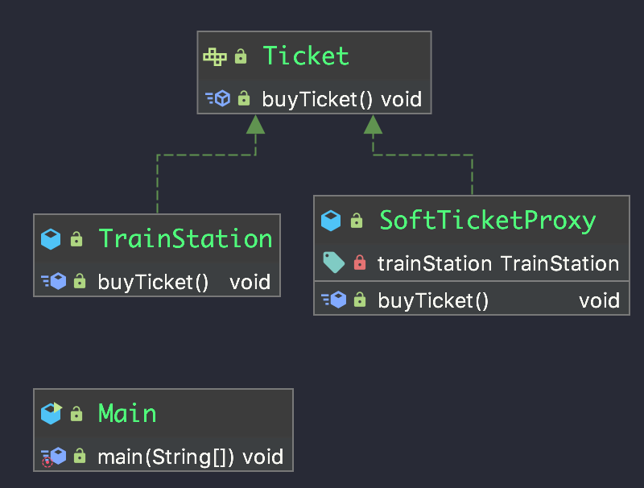

# 第一节: 静态代理

静态代理,是指代理类在程序编译运行前就已经事先知道(程序指定写死了)


## 代码

```java
package org.andywong.staticproxy;

/**
 * 代理类和被代理类的共同父类
 */
public interface Ticket {
    void buyTicket();
}

```

```java
package org.andywong.staticproxy;

/**
 * 火车站
 *
 * @author andywong
 * @date 2019-05-10 10:33
 */
public class TrainStation implements Ticket {
    @Override
    public void buyTicket() {
        System.out.println("火车站购票成功");
    }
}

```

```java
package org.andywong.staticproxy;

/**
 * 第三方购票平台
 *
 * @author andywong
 * @date 2019-05-10 10:32
 */
public class SoftTicketProxy implements Ticket {
    /**
     * 第三方是需要授权的
     */
    private TrainStation trainStation;
    @Override
    public void buyTicket() {
        if(null == trainStation){
            trainStation = new TrainStation();
        }
        trainStation.buyTicket();
        System.out.println("第三方平台购票成功");
    }
}

```

```java
package org.andywong.staticproxy;

/**
 * 测试类
 *
 * @author andywong
 * @date 2019-05-10 10:35
 */
public class Main {
    public static void main(String[] args) {
        Ticket ticket = new SoftTicketProxy();
        ticket.buyTicket();
    }
}

```


## UML

